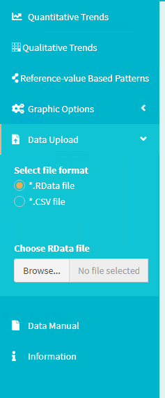

# e**lab**orator <a href='https://github.com/openpharma/elaborator'></a>

The e**lab**orator is a novel concept for generating knowledge and
gaining insights into laboratory data. You will be able to efficiently
and easily explore your laboratory data from different perspectives.

## Installation

You can install the development version from
[GitHub](https://github.com/) with:

``` r
devtools::install_github("openpharma/elaborator")
```

## Publication

Janitza, S., Majumder, M., Mendolia, F., Jeske, S., & Kulmann, H.
elaborator: A Novel App for Insights into Laboratory Data of Clinical
Trials. Therapeutic Innovation & Regulatory Science, 55, 1220-1229
(2021). <https://doi.org/10.1007/s43441-021-00318-4>.

## Example

You can launch the e**lab**orator with:

``` r
launch_elaborator()
```

The following code generates a generic example data set and saves it
locally:

``` r
set.seed(123)
lp <- 30    # number of laboratory parameter
nv <- 4     # number of visits
nsubj <- 50 # number of subjects per group
trtgp <- 4  # number of treatment groups
ntotal <- nsubj*trtgp
dat <- NULL
for(i in 1:lp){
  tmp <- data.frame(SUBJIDN=sort(rep(1:ntotal,4)),
                    AVISIT=rep(c("Baseline", "V2", "V3", "V4"),nsubj),
                    TRTP=sort(rep(c("Placebo", "Dose1", "Dose2", "Dose3"),ntotal)),
                    LBTESTCD=paste("param", i, sep=""),
                    LBORRES=abs(rnorm(ntotal,10,5)),
                    LBORNRLO=5,
                    LBORNRHI=15)
  dat <- rbind(dat, tmp)
}

## add increasing trend for first 3 parameters
idx <- dat$LBTESTCD %in% c("param1", "param2", "param3") & dat$TRTP != "Placebo"
dat$LBORRES[idx] <-  dat$LBORRES[idx] + rep(c(0,2, 4, 6),50*3)
## add decreasing trend for next 3 parameters
idx <- dat$LBTESTCD %in% c("param4", "param5", "param6") & dat$TRTP != "Placebo"
dat$LBORRES[idx] <- dat$LBORRES[idx] - rep(c(0,2, 4, 6),50*3)

save(dat,file="elab_example.RData")
```

This data set can then be loaded within the e**lab**orator using the
“Data Upload” functionality in the main menu on the left side of the
application:



Please refer to the publication mentioned above and the “Data Manual”
and “Information” tab in the main menu within the application for
further information on how to use the e**lab**orator.
