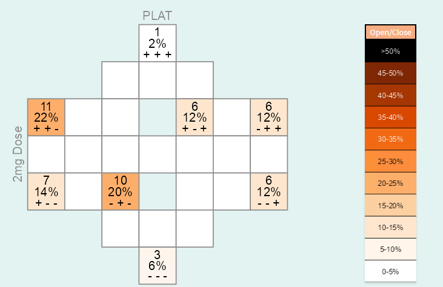
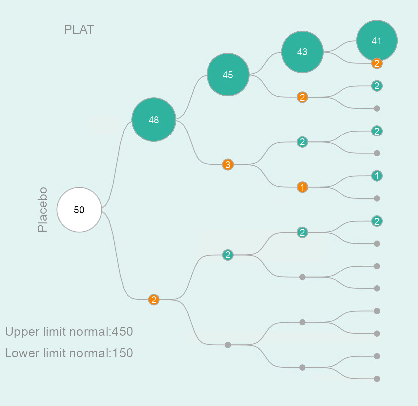

# e**lab**orator <a href='https://github.com/openpharma/elaborator'></a>

The e**lab**orator is a novel concept for generating knowledge and
gaining insights into laboratory data. You will be able to efficiently
and easily explore your laboratory data from different perspectives.

By using various types of analyses you will be able to view  your laboratory data from different perspectives. The following three different types of analyses are available:
- Quantitative trends analysis
- Qualitative trends analysis 
- Reference-value based pattern analysis

You can find a concept description of each type of analysis in the following. Available graphic and filter options as well as missing data handling are described below.

## Quantitative Trends

Aim: Examine changes in laboratory values across study visits and explore whether changes differ between treatment groups. 


This type of analysis depicts the distribution of laboratory parameters in each study visit. An example is shown in Figure 1. Figure 1 shows the distribution of platelets (in giga/l) in the 2 mg dose group at all four visits during a study ('Randomization', 'Treatment 1', 'End of Treatment' and 'Follow-up 3'). Distributions are shown using boxplots. The middle 50% of patient-specific values fall inside the box. The median value is represented by the horizontal line crossing through the box and might be used as an indicator for the central tendency. The whiskers indicate the variability in the values. The upper whisker is derived as the smaller of the maximum observed laboratory value and the third quartile (i.e. upper limit of the box) + 1.5 x interquartile range. The upper whisker is derived as the larger of the minimum observed laboratory value and the first quartile (i.e. lower limit of the box) - 1.5 x interquartile range. Values outside of the box and whiskers (outliers) are indicated as filled points.

Changes over time can be easily detected by a shift in the boxplots along the y-axis. In this example, a  decrease in platelets is observed until the End of Treatment-Visit followed by a subsequent increase between the End of Treatment-Visit and the Follow-Up 3-Visit.


## Qualitative Trends

Aim: Study frequent time courses and check if they differ between treatment groups. 


This type of analysis assesses frequent time courses that are described through increases/decreases between two subsequent study visits. A patient might, for example, have the following measurements for a specific laboratory parameter: Value 3.2 at Randomization Visit; 1.6 at Treatment 1-Visit; 2.9 at the End of Treatment-Visit; 2.9 at the Follow-Up 3-visit. The time course for this patient will be characterized as decrease (from 3.2 to 1.6) - increase (from 1.6 to 2.9) - stable (from 2.9 to 2.9). This pattern is represented as '- + ='.

In this way, the patterns / time courses for each patient can be derived and the frequency of each pattern / time course can be counted. The time courses and frequencies are transferred to a diagram-like structure. Each cell of this diagram represents one specific pattern / time course. The time courses are arranged in a symmetric way within the diagram. For example, the time course '+ + +' is represented in the cell in the top, while the 'opposite' time course '- - -' is in the cell at the bottom of the diagram. There are three entries within each of the cells: the first and second entries show the absolute and relative number of subjects in the treatment group which have the specific time course, and the third entry shows the respective time course. You can use the font size slider to display the entries and increase the size of the numbers. By default, the font size is set to 0, that is, all entries are blocked. When a time course does not occur at all (i.e. the frequency and percentage are 0), the entries of the cell are not shown by default.

The frequency of a time course is shown by the color of the cell. Darker colors reflect more frequent and lighter colors less frequent time courses. The color key is provided on the right side of Figure 2. It can also be suppressed by clicking on the 'Open/close'-button above the color legend.  No more than approx. 5 visits are recommended because diagrams will get too complex with increasing number of cells.



## Reference-value Based Patterns

Aim: Assess how many patients have laboratory values outside the normal range during the study and whether there is a difference between treatment groups.
            
The tree diagram consists of a starting point (i.e. the root of the tree) and several layers. The first layer represents the first visit, the second layer the second visit, and so on. An example for a specific laboratory parameter in the placebo group is shown in Figure 3. You are able to track patients during the trial, and identify at which visits abnormal laboratory values occur. From the starting point the sample is split up into two groups: one group with patients who have laboratory values outside the normal range at the first visit (lower path / orange circle) and the other group of patients with laboratory values inside the normal range at the first visit (upper path / green circle). Each of the groups is then split up based on the laboratory values at the second visit, and so on. Note that patients may have different normal ranges for the same laboratory parameter.

The size of the circles is proportional to the number of patients. This enables users to identify frequent patterns (e.g. normal - abnormal - abnormal - normal) among visits. The total number of patients is depicted inside the circle at the starting point.

No more than approx. 5 visits are recommended because tree structures will get too complex with an increasing number of layers.

Laboratory parameters without reference range(s) are not analysed. Thus, for the reference-value based pattern analysis the total number of plots shown might be smaller than for the other two analyses types.




## Installation

You can install the development version from
[GitHub](https://github.com/) with:

``` r
devtools::install_github("openpharma/elaborator")
```

You can launch the e**lab**orator with:

``` r
launch_elaborator()
```

## Publication

Janitza, S., Majumder, M., Mendolia, F., Jeske, S., & Kulmann, H.
elaborator: A Novel App for Insights into Laboratory Data of Clinical Trials. Therapeutic Innovation & Regulatory Science, 55, 1220-1229 (2021). <https://doi.org/10.1007/s43441-021-00318-4>.

## Data Manual

Currently, the following two file formats are supported:
- A **c**omma **s**eparated **v**alues (CSV) file
- An RData file

In order to use the e**lab**orator, your laboratory data file has to include the following columns:

- a subject identifier (called **SUBJIDN**)
- the visit (called **AVISIT**)
- the treatment group (called **TRTP**)
- an (abbreviated) name of the laboratory parameter (called **LBTESTCD**) 
- the laboratory value measurement (called **LBORRES**) 
- the lower limit of normal (LLN) (called **LBORNRLO**) 
- the upper limit of normal (ULN) (called **LBORNRHI**)

Please consider the following:
- Missing laboratory values must be coded as NA . We recommend carefully reading the section on *Handling Missing Data* in the *Information*-tab of the app for correct interpretation. The section describes in detail how the e**lab**orator deals with missing data.
- If a laboratory parameter has no lower  or upper limit of normal, please do not insert any character in the respective cell but leave the cell empty or use the NA coding. Please do not use blank/space.
- Variable names must be spelled correctly as shown above (please use upper case letters).
- Do not use special characters for variable names or laboratory parameter names.
- All laboratory measurements have to be numeric. That means, do not use '+', '-', '>', '<', 'negative' etc. For example, '<1' is not a valid laboratory measurement.
- **Please always check your data carefully before uploading it to the elaborator.** You can also inspect the data loaded in the e**lab**orator app via the *Raw Data*-tab.

### Example 

The following code generates a generic example data set and saves it locally:

``` r
set.seed(123)
lp <- 30    # number of laboratory parameter
nv <- 4     # number of visits
nsubj <- 50 # number of subjects per group
trtgp <- 4  # number of treatment groups
ntotal <- nsubj*trtgp
dat <- NULL
for(i in 1:lp){
  tmp <- data.frame(SUBJIDN=sort(rep(1:ntotal,4)),
                    AVISIT=rep(c("Baseline", "V2", "V3", "V4"),nsubj),
                    TRTP=sort(rep(c("Placebo", "Dose1", "Dose2", "Dose3"),ntotal)),
                    LBTESTCD=paste("param", i, sep=""),
                    LBORRES=abs(rnorm(ntotal,10,5)),
                    LBORNRLO=5,
                    LBORNRHI=15)
  dat <- rbind(dat, tmp)
}

## add increasing trend for first 3 parameters
idx <- dat$LBTESTCD %in% c("param1", "param2", "param3") & dat$TRTP != "Placebo"
dat$LBORRES[idx] <-  dat$LBORRES[idx] + rep(c(0,2, 4, 6),50*3)
## add decreasing trend for next 3 parameters
idx <- dat$LBTESTCD %in% c("param4", "param5", "param6") & dat$TRTP != "Placebo"
dat$LBORRES[idx] <- dat$LBORRES[idx] - rep(c(0,2, 4, 6),50*3)

save(dat,file="elab_example.RData")
```

This data set can then be loaded within the e**lab**orator using the “Data Upload” functionality in the main menu on the left side of the application:


Please refer to the publication mentioned above and the “Data Manual” and “Information” tab in the main menu within the application for further information on how to use the e**lab**orator.
